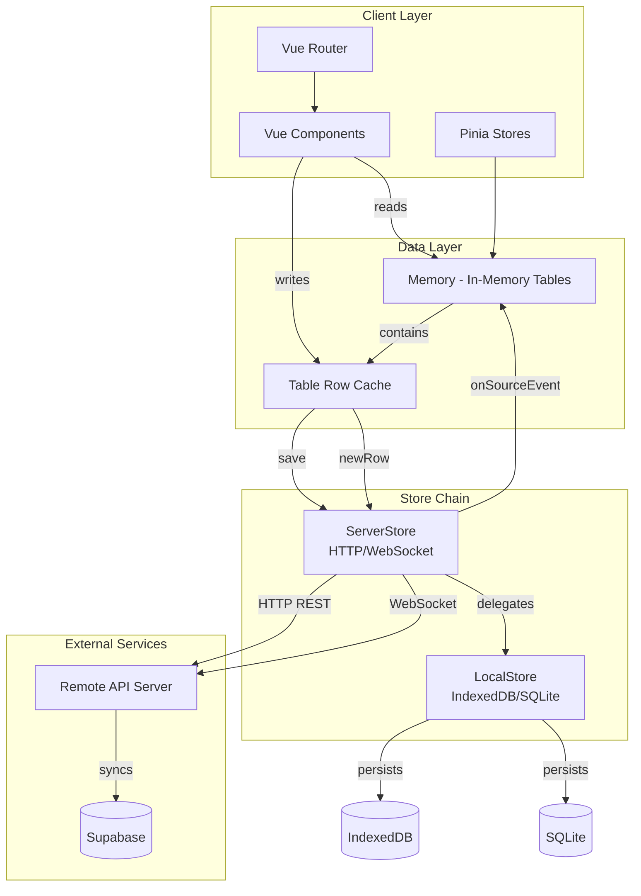
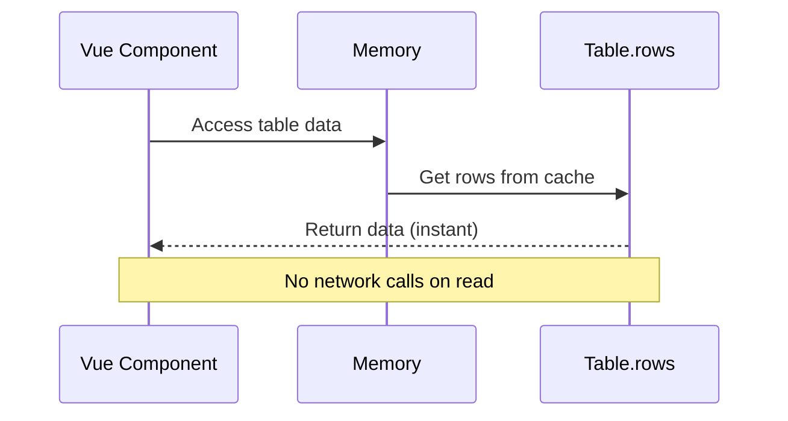
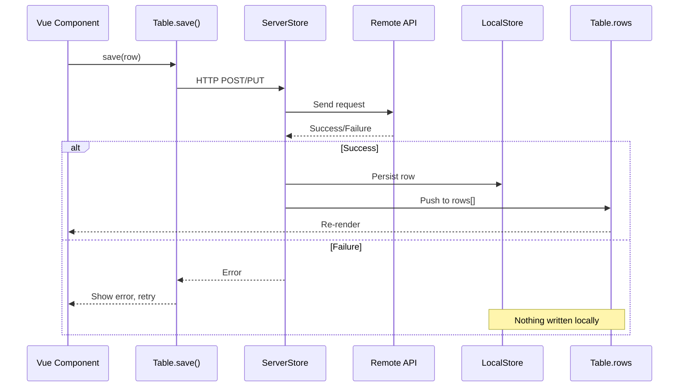
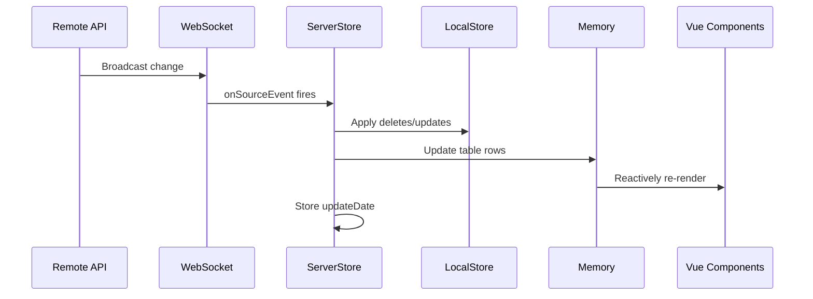
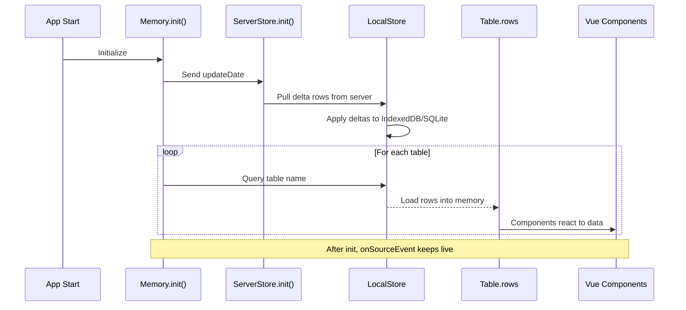
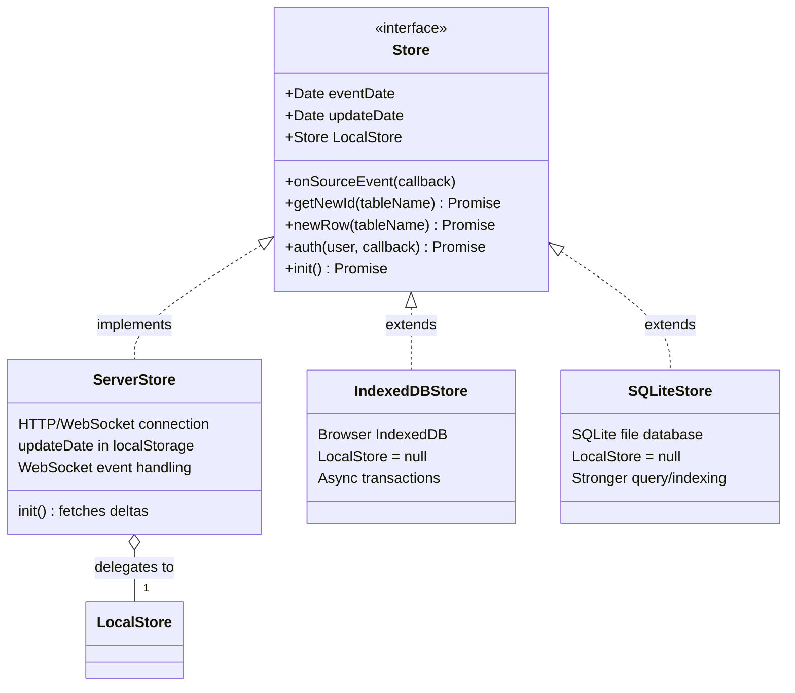
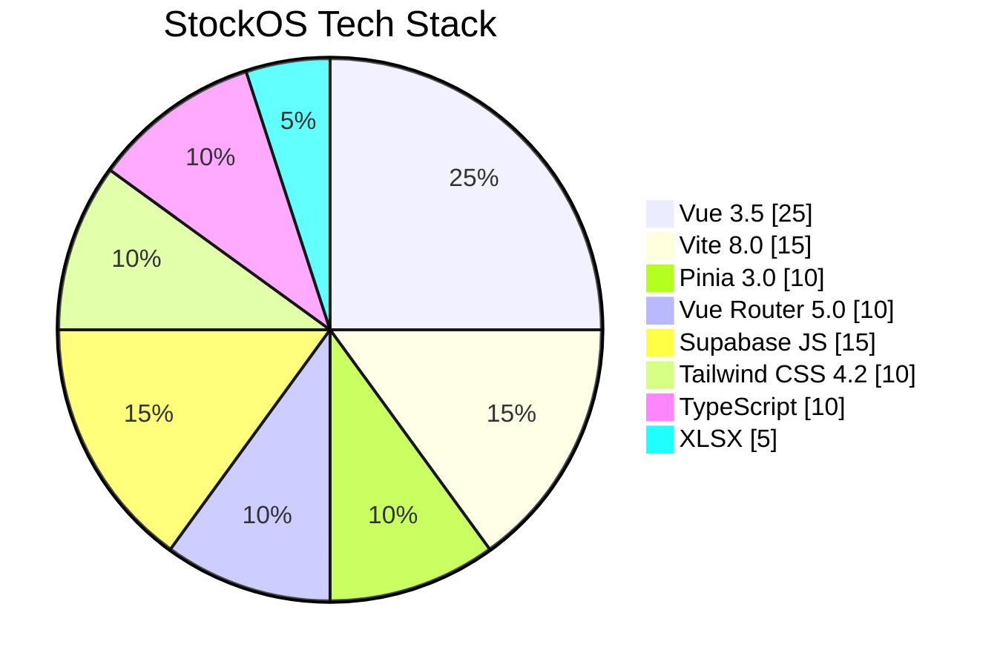

# StockOS Solution Architecture Diagram

## System Overview



---

## Data Flow Diagrams

### Read Path (Zero Network Calls)



### Write Path (Server-First, Pessimistic)



### Real-Time Sync Path (Server Push)



---

## Application Startup Flow



---

## Store Interface Contract



---

## Technology Stack



---

## Project Structure

```
d:\SOS\
├── src/                          # Main source directory
│   ├── components/               # Vue components
│   ├── composables/              # Vue composition functions
│   ├── router/                   # Vue Router configuration
│   ├── stores/                   # Pinia stores (current prototype)
│   ├── sw/                       # Service Worker files
│   ├── utils/                    # Utility functions & channels
│   ├── views/                    # Page views
│   ├── web/                      # Web-specific code
│   ├── workspace/                # Workspace modules
│   ├── App.vue                   # Root component
│   ├── main.ts                   # Application entry point
│   ├── index.ts                  # Module exports
│   └── help.ts                   # Helper functions
├── api/                          # Backend API server
├── Supabase/                     # Supabase configuration
├── assets/                       # Static assets
├── dist/                         # Production build output
├── node_modules/                 # Dependencies
├── package.json                  # Project configuration
├── vite.config.js                # Vite build configuration
├── tsconfig.json                 # TypeScript configuration ⚠️ (has bugs)
├── tailwind.config.js            # Tailwind CSS config
├── postcss.config.js             # PostCSS config
├── manifest.json                 # Web app manifest
├── index.html                    # HTML entry point
└── worker.js                     # Web Worker
```

---

## Known Build Issues

### From build.log:
```
TypeError: manualChunks is not a function
  at rolldown/dist/shared/rolldown-build
```

**Root Cause:** The `manualChunks` option in `vite.config.js` is defined as an **object**, but the build tool (rolldown) expects a **function**.

**Current (incorrect):**
```js
manualChunks: {
  supabase: ['@supabase/supabase-js'],
  xlsx: ['xlsx'],
  vendor: ['vue', 'vue-router', 'pinia'],
}
```

**Should be (function):**
```js
manualChunks(id) {
  if (id.includes('node_modules')) {
    if (id.includes('@supabase')) return 'supabase';
    if (id.includes('xlsx')) return 'xlsx';
    if (id.includes('vue') || id.includes('pinia') || id.includes('vue-router')) return 'vendor';
  }
}
```

---

## Migration Path (Current → Target Architecture)

```mermaid
graph LR
    subgraph "Current State"
        A[Pinia Stores + localStorage]
    end

    subgraph "Target State"
        B[Memory Instance]
        C[ServerStore]
        D[IndexedDBStore/SQLiteStore]
        E[Table.save]
    end

    A -->|1. Replace Pinia with Memory| B
    B -->|2. Implement ServerStore| C
    C -->|3. Choose LocalStore| D
    D -->|4. Replace localStorage.setItem| E
    E -->|5. Subscribe to onSourceEvent| F[Zero component changes needed]

    Note: Vue components require ZERO changes
```

---

## Summary

| Item | Status | Notes |
|------|--------|-------|
| tsconfig.json | ❌ Has Bugs | Trailing comma, duplicate lib entries, invalid path mapping |
| vite.config.js manualChunks | ❌ Has Bug | Object type instead of function |
| Architecture Design | ✅ Documented | Offline-first, layered store pattern |
| Vue Components | ✅ Ready | Zero changes needed for migration |
| Pinia → Memory Migration | 🔄 Planned | 5-step migration path defined |
