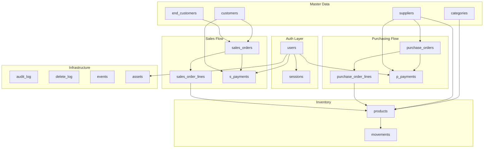

# SOS ERP — Database Design Analysis

## Project Architecture (Mental Model)

---

## Schema Summary

| Table | Purpose | Mutable? | Audited? |
|---|---|---|---|
| `users` | User accounts & roles | ✅ (limited) | ✅ |
| `sessions` | Auth sessions (JWT-like) | ✅ | ❌ exempt |
| `categories` | Product categories | ✅ | ✅ |
| `suppliers` | Vendors / suppliers | ✅ | ✅ |
| `customers` | B2B clients | ✅ | ✅ |
| `end_customers` | Final recipients (B2C) | ✅ | ✅ |
| `products` | Inventory catalog | ✅ (soft-delete) | ✅ |
| `movements` | Stock ledger | ❌ INSERT-ONLY | ❌ exempt |
| `purchase_orders` | Inward orders | ✅ | ✅ |
| `purchase_order_lines` | PO line items | ✅ (while open) | ✅ |
| `sales_orders` | Outward orders | ✅ | ✅ |
| `sales_order_lines` | SO line items | ✅ (while open) | ✅ |
| `s_payments` | Sales payments | ❌ INSERT-ONLY | ✅ (insert only) |
| `p_payments` | Purchase payments | ❌ INSERT-ONLY | ✅ (insert only) |
| `assets` | Files / media | ✅ (soft-delete only) | ❌ exempt |
| `audit_log` | Change history | ❌ | — |
| `delete_log` | Deletion history | ❌ | — |
| `events` | SSE notification queue | ❌ | — |

---

## Key Constraints Applied

### 1. `created_at` as Optimistic Lock / Version Token
- All business tables store `created_at` as **BIGINT (epoch ms)**.
- `raise_if_created_at_changed()` trigger silently **restores** any attempt to change it.
- The app should call `fn_check_version(table, id, created_at)` before any UPDATE to detect race conditions.

### 2. UUID IDs — DB-generated, immutable
- All `id` columns default to `gen_random_uuid()`.
- `raise_if_id_changed()` trigger silently **ignores** any ID mutation on UPDATE.

### 3. Dates are BIGINT (epoch milliseconds)
- `now_ms()` function returns `EXTRACT(EPOCH FROM clock_timestamp())::BIGINT * 1000`.
- No `TIMESTAMP` or `DATE` columns exist in business tables.

### 4. INSERT-ONLY Immutability
- `movements`: any UPDATE or DELETE raises an exception.
- `s_payments` / `p_payments`: same — issue a corrective payment instead.
- `assets`: only the `deleted` flag may be changed.

### 5. Frozen Columns on Order Lines
- `sales_order_lines.product_id` → `fn_sol_freeze_product_id()` blocks UPDATE.
- `purchase_order_lines.product_id` → `fn_pol_freeze_product_id()` blocks UPDATE.

### 6. Lines Blocked When Order is Closed
- INSERT / UPDATE / DELETE on `sales_order_lines` raises if `sales_orders.open = FALSE`.
- Same for `purchase_order_lines` / `purchase_orders.open`.

### 7. Audit Log
- Every INSERT / UPDATE / DELETE on all business tables (except the exempt list) fires `fn_audit_log()`.
- Payload stores full `before` and `after` JSON for UPDATEs.

### 8. Stock Integrity
- `fn_movements_update_stock()` fires BEFORE INSERT on `movements`.
- Validates `before` = current stock (prevents race).
- Validates `after` = `before ± qty` exactly.
- Rejects if `after < 0`.
- Atomically updates `products.stock`.

### 9. Order Total Recalculation
- `fn_pol_recalc_order_totals()` → fires AFTER any change to `purchase_order_lines`.
- `fn_sol_recalc_order_totals()` → fires AFTER any change to `sales_order_lines`.
- `fn_so_recalc_totals_on_tax()` → fires BEFORE UPDATE of `tax_pct` or `subtotal` on sales order.

### 10. Status Transition Guard
- `fn_advance_sales_order_status()` enforces the state machine:
  `draft → confirmed → processing → shipped → delivered`
- `fn_advance_purchase_order_status()` enforces:
  `draft → confirmed → received`
- Both return a JSONB with `{ok: true}` or `{error: string}`.

---

## Stored Functions Reference

| Function | Purpose |
|---|---|
| `now_ms()` | Current epoch ms |
| `fn_check_version(tbl, id, created_at)` | Optimistic lock check |
| `fn_open_sales_order(id, uid, role)` | Lock SO for editing |
| `fn_close_sales_order(id, uid, role)` | Release SO lock |
| `fn_open_purchase_order(id, uid)` | Lock PO for editing |
| `fn_close_purchase_order(id)` | Release PO lock |
| `fn_receive_purchase_order(id, uid)` | Close PO + add stock movements |
| `fn_ship_sales_order(id, uid)` | Ship SO + deduct stock movements |
| `fn_advance_sales_order_status(id, status, uid)` | State machine transition |
| `fn_advance_purchase_order_status(id, status)` | State machine transition |

---

## 15 Suggested Missing Features

> [!IMPORTANT]
> These features are documented in Section 15 of `database-init.sql` as comments.

1. **Discounts** — discount_pct / fixed on headers + lines
2. **Multiple Tax Rates** — VAT/GST table linked to products
3. **Multi-Currency** — currency_code + exchange_rate on orders
4. **Shipping Fields** — carrier, tracking_number, shipping_cost on SO
5. **Returns / RMA** — return_orders + credit notes
6. **Multi-Warehouse** — stock per (product × warehouse)
7. **Batch / Lot Tracking** — serial/expiry in movements
8. **Invoices** — separate invoice entity (can span multiple orders)
9. **Credit Limits** — customer.credit_limit, block on SO creation
10. **Audit User ID** — who made the change in audit_log rows
11. **Global Soft-Delete** — `deleted` + `deleted_at` on ALL tables
12. **pg_notify in Audit** — `NOTIFY` call in `fn_audit_log` for SSE fan-out
13. **User Avatar** — `avatar_asset_id` FK on users → assets
14. **Tags / Labels** — M2M tags on products, orders
15. **Price Lists** — per-customer negotiated pricing table
